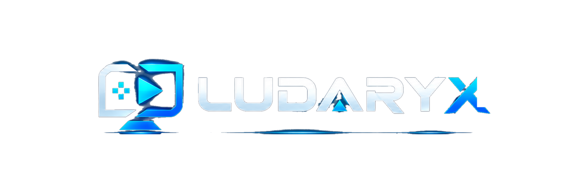
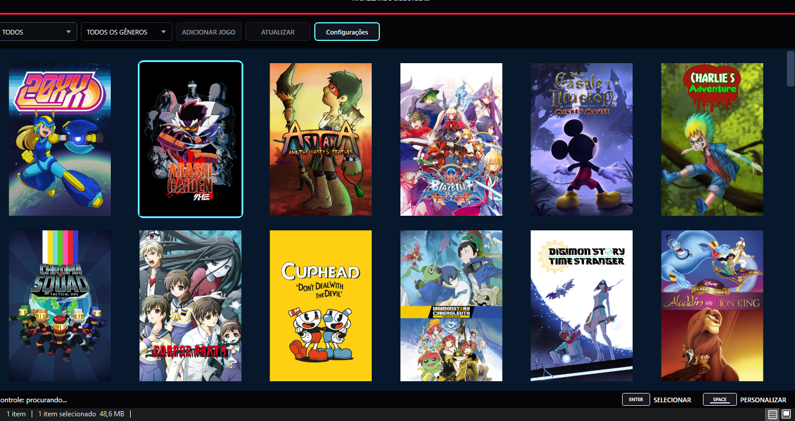
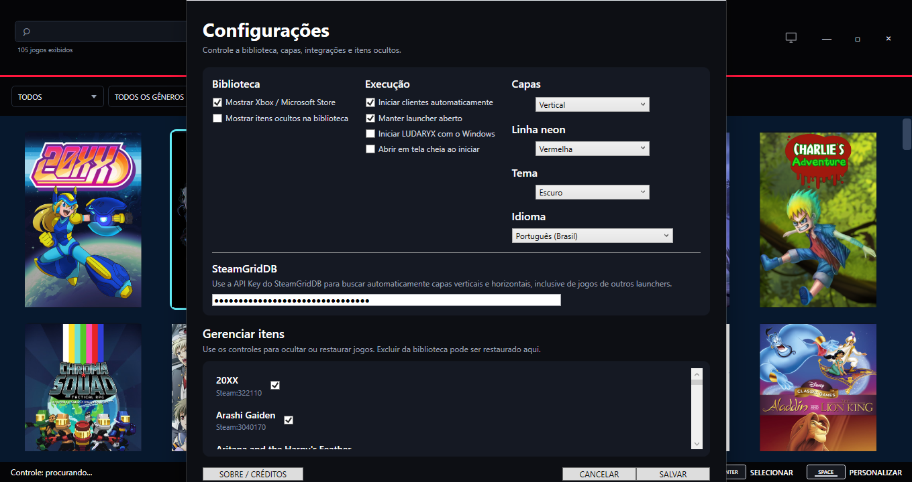

# LUDARYX

<p align="center">
  
</p>

**LUDARYX** é um launcher unificado e gratuito para Windows que organiza e inicia jogos instalados em diferentes plataformas em uma única biblioteca.



## Recursos

- Biblioteca unificada para Steam, Epic Games, GOG, Xbox/Microsoft Store, EA app, Ubisoft Connect, Battle.net e Riot Client.
- Adição manual de jogos.
- Capas vertical/horizontal, arte personalizada e integração opcional com SteamGridDB.
- Metadados, gêneros, desenvolvedora, publicadora e descrições localizadas com fallback em inglês.
- Favoritos, itens ocultos, recentes, duplicados e classificação manual.
- Navegação por mouse e teclado, controles Xbox compatíveis com XInput e controle PlayStation 5 DualSense.
- Modo tela cheia e interface adequada para uso a distância.
- Configurações e segredos locais; API keys persistidas protegidas com Windows DPAPI.
- Sem telemetria própria nesta versão.

## Versão

**LUDARYX 1.0.1** — atualização de manutenção com filtro aprimorado da Microsoft Store e atualizador seguro via GitHub.

## Requisitos para desenvolvimento

- Windows 10/11 x64
- .NET 8 SDK
- Visual Studio 2022, Rider ou VS Code com suporte a C#
- Inno Setup, somente se você quiser gerar o instalador

## Compilar

```powershell
dotnet restore
dotnet build -c Release
```

## Executar durante o desenvolvimento

```powershell
dotnet run
```

## Publicar uma build Windows x64

Use o script de publicação para gerar o launcher e o updater auxiliar juntos:

```powershell
powershell -ExecutionPolicy Bypass -File Scripts\Publish-Release.ps1
```

O script publica `LUDARYX.exe` e `LUDARYX.Updater.exe` na mesma pasta. Depois, compile `LUDARYX-Installer-1.0.1.iss` no Inno Setup para criar o instalador.

## SteamGridDB

A integração é opcional. Obtenha sua própria API key no SteamGridDB e informe-a em **Configurações**. A chave é armazenada localmente em formato protegido pela DPAPI e não deve ser adicionada ao repositório.

## Organização do código

- `Models/` — modelos de dados e configuração.
- `Providers/` — descoberta e lançamento por plataforma.
- `Services/` — biblioteca, metadados, capas, controles, persistência, segurança e diagnóstico.
- `Assets/` — identidade visual e sons incorporados.
- `Docs/` — arquitetura, edição manual, segurança, screenshots e histórico.

Leia [`Docs/ARCHITECTURE.md`](Docs/ARCHITECTURE.md) e [`Docs/MANUAL-EDITING.md`](Docs/MANUAL-EDITING.md) antes de alterações grandes.

## Configurações



Idiomas disponíveis:

- Português (Brasil)
- Português (Portugal)
- English (US)
- English (UK) — inglês britânico (`en-GB`)
- Español (Latinoamérica)
- Español (España)

## Compatibilidade de controles

O LUDARYX oferece navegação por:

- mouse e teclado;
- controles Xbox compatíveis com XInput;
- controle PlayStation 5 DualSense.

A menção a Xbox, PlayStation e DualSense descreve apenas compatibilidade técnica. LUDARYX não é afiliado, patrocinado ou endossado pela Microsoft ou pela Sony.

## Diagnóstico

A tela **Sobre / Créditos** mostra a versão do LUDARYX, Windows, .NET e arquitetura do processo, além de permitir abrir a pasta de logs. Os logs são locais, limitados e não registram API keys, tokens ou a biblioteca completa. Revise qualquer log antes de publicá-lo em uma issue.

## Privacidade e fontes externas

O LUDARYX pode consultar serviços externos para metadados e capas. Consulte:

- [`PRIVACY.md`](PRIVACY.md)
- [`DATA-SOURCES.md`](DATA-SOURCES.md)
- [`LEGAL-NOTICE.md`](LEGAL-NOTICE.md)
- [`THIRD-PARTY-NOTICES.txt`](THIRD-PARTY-NOTICES.txt)

## Releases

Binários, instaladores e ZIPs compilados devem ser publicados em **GitHub Releases**, e não commitados no repositório. Para gerar hashes SHA-256 de uma release, use `Scripts/Generate-ReleaseHashes.ps1`.

A build inicial pode ser distribuída sem assinatura digital, mas o Windows SmartScreen pode apresentar aviso de editor desconhecido. Não afirme que uma build é assinada se ela não for.

## Desenvolvimento com auxílio de IA

O LUDARYX foi desenvolvido com o auxílio de ferramentas de inteligência artificial, incluindo o **ChatGPT**, em tarefas como geração e revisão de código, correção de erros, documentação, refinamento da interface e organização do projeto.

A direção do projeto, as decisões de funcionalidades, os testes, a validação das builds e a responsabilidade final pelo software permanecem com o mantenedor do projeto. Mais detalhes estão em [`Docs/AI-ASSISTANCE.md`](Docs/AI-ASSISTANCE.md).

## Contribuições

Consulte [`CONTRIBUTING.md`](CONTRIBUTING.md). Bugs e sugestões possuem templates próprios em `.github/ISSUE_TEMPLATE/`.

## Licença

O código-fonte do LUDARYX é disponibilizado sob a **MIT License**. Consulte [`LICENSE`](LICENSE).

Marcas, nomes de produtos, artes, capas, descrições e outros conteúdos de terceiros continuam pertencendo aos seus respectivos titulares e não são relicenciados pela licença MIT do código do LUDARYX.


## Atualizações automáticas

A partir da versão 1.0.1, o LUDARYX pode verificar novas releases publicadas neste repositório. O fluxo automático:

1. consulta a release mais recente do GitHub;
2. baixa o instalador com progresso visual;
3. baixa `SHA256SUMS.txt`;
4. valida o SHA-256 antes de permitir a instalação;
5. usa `LUDARYX.Updater.exe` como processo auxiliar para aguardar o fechamento do launcher e abrir o instalador.

Para que a atualização automática funcione, cada release deve incluir um instalador `.exe` e um `SHA256SUMS.txt` contendo o hash SHA-256 desse instalador. Se o arquivo de hashes estiver ausente ou não corresponder ao instalador, o LUDARYX bloqueia a instalação automática e direciona o usuário para a release no GitHub.
